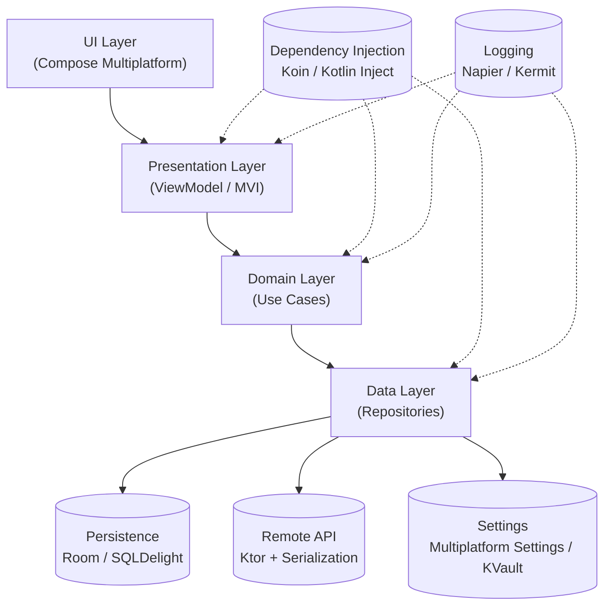

# 📒 CrossNotes  

> Eine **Kotlin Multiplatform (KMP)** & **Compose Multiplatform (CMP)** Showcase-App zum Demonstrieren moderner Architektur, Bibliotheken und Best Practices.  

CrossNotes ist eine plattformübergreifende **Notiz- und ToDo-App**, die auf **Android, iOS und Desktop** läuft – mit gemeinsamem Code für Logik, Datenhaltung und Architektur.  

---

## 🚀 Features  

- ✍️ **Notizen & ToDos erstellen, bearbeiten, löschen**  
- 💾 **Persistenz** mit **Room (KMP)** oder **SQLDelight**  
- 🔄 **Offline-First** Architektur mit Sync zur API (Ktor Client)  
- ⚙️ **Settings** (Dark Mode, Sprache, User Preferences) via **Multiplatform Settings / KVault**  
- 🧭 **Navigation** mit **Voyager** oder **Decompose**  
- 🏗️ **MVI / StateFlow Architektur** für reaktiven UI-State  
- 🔌 **Dependency Injection** mit **Koin**  
- 📊 **Tests** mit **Kotest & Turbine**  
- 📝 **Logging** mit **Napier**  

---

## 🏛️ Architektur  

CrossNotes folgt einer **Clean Architecture** mit klar getrennten Layern:  



---

## 🛠️ Tech Stack  

| Bereich | Libraries / Tools |
|---------|-------------------|
| **UI** | Compose Multiplatform |
| **Navigation** | Voyager / Decompose |
| **Persistenz** | Room (KMP) / SQLDelight |
| **Netzwerk** | Ktor Client + kotlinx.serialization |
| **Settings** | Multiplatform Settings / KVault |
| **State Mgmt** | MVI mit StateFlow / Orbit MVI |
| **DI** | Koin |
| **Logging** | Napier / Kermit |
| **Testing** | Kotest, Turbine (für Flows) |

---

## 📱 Screenshots (Demo)  

👉 tbd  

---

## 🔧 Setup & Installation  

### Voraussetzungen  
- [Kotlin 2.x](https://kotlinlang.org)  
- [Android Studio](https://developer.android.com/studio) mit KMP-Support  
- Xcode (für iOS Build)  

### Starten  
```bash
# Repo klonen
git clone https://github.com/fabian-rump/crossnotes.git
cd crossnotes

# Android App starten
./gradlew :androidApp:installDebug

# Desktop App starten
./gradlew :desktopApp:run
```

---

## 📂 Projektstruktur  

```plaintext
crossnotes/
 ├── androidApp/      # Android spezifisch
 ├── iosApp/          # iOS spezifisch
 ├── desktopApp/      # Desktop spezifisch
 └── shared/          # Shared KMP Code
      ├── ui/         # Compose UI
      ├── presentation/ # ViewModels / State
      ├── domain/     # Use Cases
      └── data/       # Repositories, API, DB
```

---

## 🧑‍💻 Contributing  

Pull Requests, Issues und Feature-Ideen sind herzlich willkommen!  
Bitte beachte den [Contribution Guide](CONTRIBUTING.md).  

---

## 📜 License  

MIT License © 2025 [Fabian Rump]  
