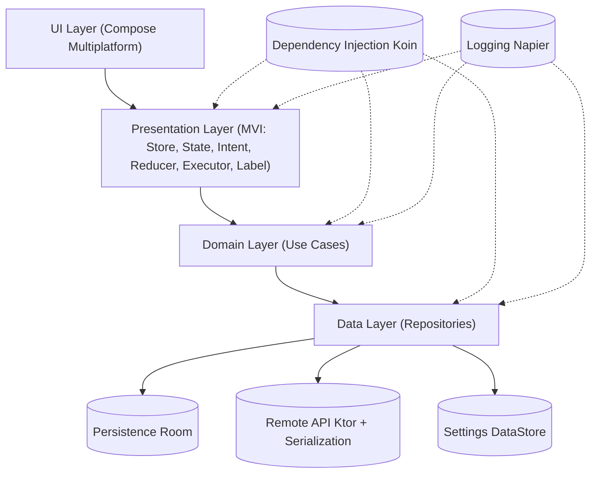
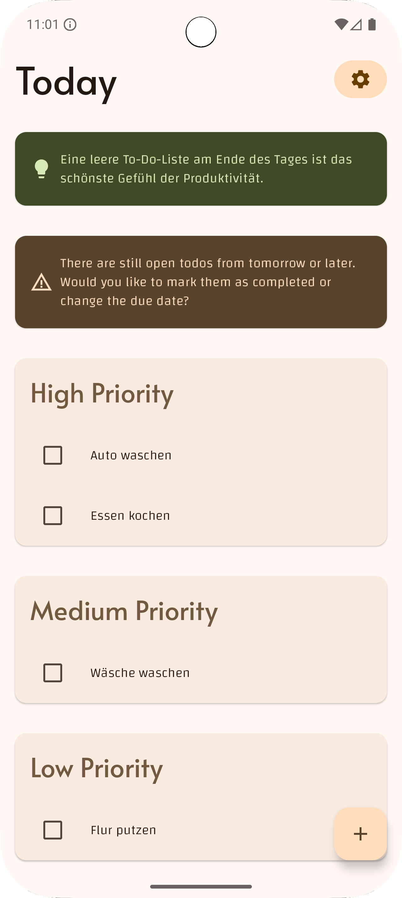
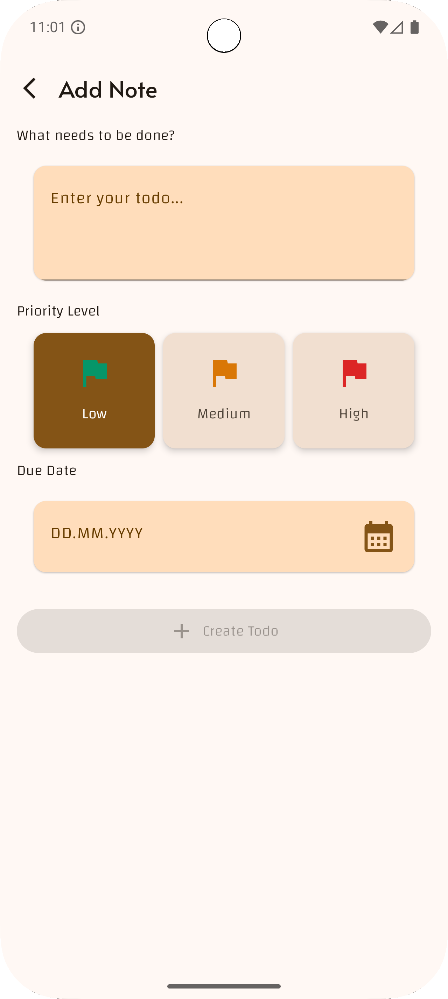
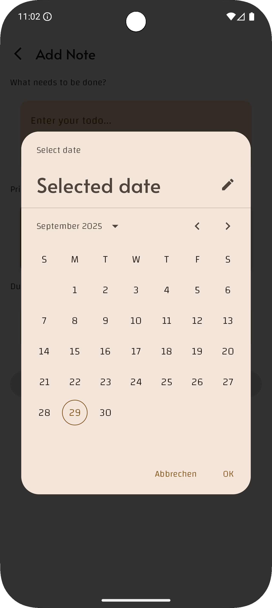
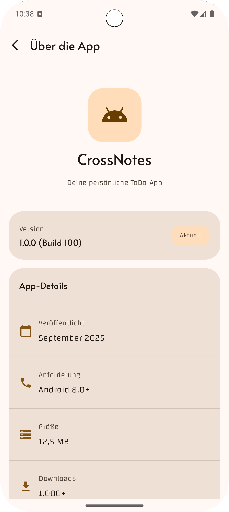
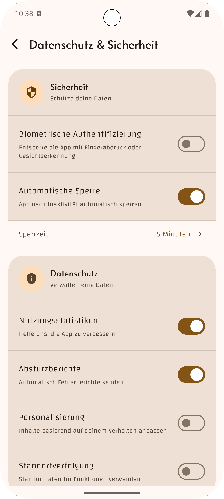
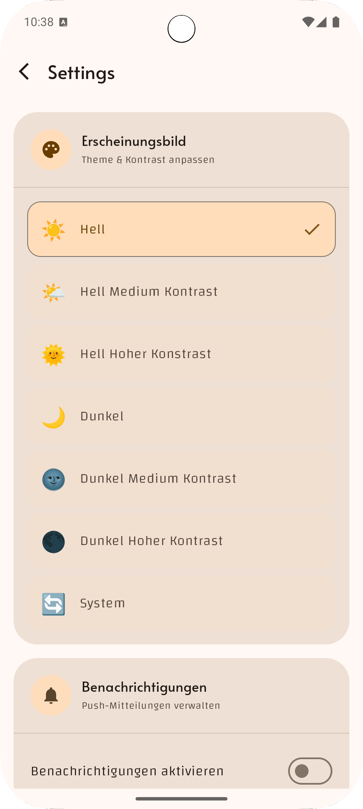

# 📒 CrossNotes  

> Eine **Kotlin Multiplatform (KMP)** & **Compose Multiplatform (CMP)** Showcase-App zum Demonstrieren moderner Architektur, Bibliotheken und Best Practices.  

CrossNotes ist eine plattformübergreifende **Notiz- und ToDo-App**, die auf **Android und iOS** läuft – mit gemeinsamem Code für Logik, Datenhaltung und Architektur.  

---

## 🚀 Features  

- ✍️ **ToDos erstellen, abhaken und Einsehen der Historie**  
- 💾 **Persistenz** mit **Room (KMP)** und **SQLDelight**  
- 🔄 **Offline-First** Architektur mit Sync zur API (Ktor Client)  
- ⚙️ **Settings** (Dark Mode, Todo Historie, User Preferences) via **DataStore**  
- 🧭 **Navigation** mit **Compose Navigation**  
- 🏗️ **MVI / StateFlow Architektur** für reaktiven UI-State  
- 🔌 **Dependency Injection** mit **Koin**  
- 📊 **Tests** mit **Kotest & Turbine**  
- 📝 **Logging** mit **Napier**  

---

## 🏛️ Architektur  

CrossNotes folgt einer **Clean Architecture** mit klar getrennten Layern:  



---

## 🛠️ Tech Stack

| Bereich         | Libraries / Tools                    |
|-----------------|--------------------------------------|
| **UI**          | Compose Multiplatform                |
| **Navigation**  | Compose Navigation (Jetpack)         |
| **Persistenz**  | Room (KMP-kompatibel)                |
| **Netzwerk**    | Ktor Client + kotlinx.serialization   |
| **Settings**    | Jetpack DataStore (Multiplatform)    |
| **State Mgmt**  | MVI mit StateFlow / Coroutines       |
| **DI**          | Koin                                 |
| **Logging**     | Napier                               |
| **Testing**     | Kotest, Turbine (für Flows)    |

---

## 📱 Screenshots (Demo)









## 🔧 Setup & Installation

### Voraussetzungen  
- [Kotlin 2.x](https://kotlinlang.org)  
- [Android Studio](https://developer.android.com/studio) mit KMP-Support  
- Xcode (für iOS Build)  

### Starten  
```bash
# Repo klonen
git clone https://github.com/fabian-rump/crossnotes.git
cd crossnotes

# Android App starten
./gradlew :androidApp:installDebug
Zudem muss eine .gradle.properties erstellt werden mit dem Inhalt
apiKey="YOUR_HOLIDAY_API_KEY"
von "holidays.abstractapi.com"

# Desktop App starten
Um die iOS App starten zu können muss unter Product -> Scheme -> Edit Scheme als Umgebungsvariable
API_KEY=YOUR_HOLIDAY_API_KEY gesetzt werden.
./gradlew :desktopApp:run
```

---

## 📂 Projektstruktur  

```plaintext
crossnotes/
 ├── androidApp/        # Android spezifisch
 ├── iosApp/            # iOS spezifisch
 └── shared/            # Shared KMP Code
      ├── ui/           # Compose UI
      ├── presentation/ # Store, State, Intent, Reducer, Executor, Label
      ├── domain/       # Use Cases
      └── data/         # Repositories, API, DB
```

---

## 🧑‍💻 Contributing  

Pull Requests, Issues und Feature-Ideen sind herzlich willkommen!  
Bitte beachte den [Contribution Guide](CONTRIBUTING.md).  

---

## 📜 License  

MIT License © 2025 [Fabian Rump]  
